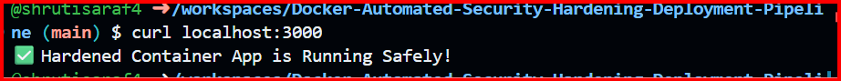
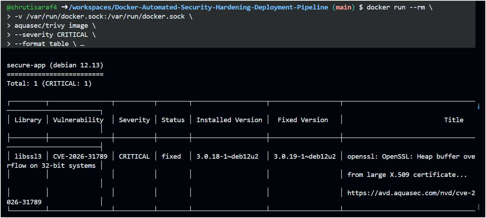

# Docker Automated Security Hardening & Deployment Pipeline


An end-to-end, fully automated container infrastructure pipeline. This project builds a highly secure, minimized multi-stage **Docker** image, automatically subjects it to an aggressive vulnerability scan using **Trivy**, and safely handles production deployment or failure rollbacks using a single command wrapper.

---

## 🏗️ Architecture Overview

The automation follows a strict gatekeeper pattern:

```text
[Code Change] 
      │
      ▼
 🔨 Multi-Stage Build (Removes compilation tooling & root access)
      │
      ▼
 🔍 Trivy Security Scan (Audits system dependencies for CVEs)
      │
 ┌────┴───────────────┐
 │                    │
 ▼                    ▼
[❌ Critical Found]   [✅ Pass / Clean]
 │                    │
 ▼                    ▼
🛑 Block & Teardown   🚀 Upstream Background Deployment
```

---

## ⚡ Features

- **One-Click Execution:** Build, scan, and deploy using a simple `make deploy` wrapper.
- **Distroless Hardening:** Application runtime strips out system shells, package managers (`apt`, `npm`), and drops root privileges.
- **Automated Security Gate:** The pipeline returns a failing exit status code and halts deployment if any `CRITICAL` flaws are caught.
- **Network Isolation:** Runs on a dedicated internal bridge network away from the host system daemon.

---

## 📷 System Screenshots

### 1. Successful Pipeline Execution
*Below shows the process running cleanly, passing the security audits, and spinning up the application safely.*

<!-- Replace the URL below with your actual screenshot image path -->


### 2. Automated Security Block (Failure Fallback)
*Below shows the pipeline identifying critical package vulnerabilities, throwing a failure code, and tearing down the infrastructure safely.*

<!-- Replace the URL below with your actual screenshot image path -->


---

## 🛠️ Step-by-Step Installation & Usage

### Prerequisites
Ensure your local machine has the following tools installed:
- [Docker Desktop](https://www.docker.com/products/docker-desktop/)
- GNU `make` (Installed by default on Linux/macOS)

### Step 1: Clone the Repository
```bash
git clone https://github.com/YOUR-USERNAME/Docker-Automated-Security-Hardening-Pipeline.git
cd Docker-Automated-Security-Hardening-Pipeline
```

### Step 2: Launch the Automated Pipeline
Run the automation entry point. This makes the system scripts executable, tears down stale environments, builds your hardened image, and triggers the vulnerability audit:
```bash
make deploy
```

### Step 3: Verify the App Is Online
If the security gate clears, your minimal container will be running in detached background mode. Open your web browser and navigate to:
```text
http://localhost:3000
```

### Step 4: Clean Up Environment
To spin down running containers, remove networks, and clear out caching volumes, execute:
```bash
make clean
```

---

## 📂 Repository File Breakdown

- `Dockerfile`: Multi-stage compilation recipe separating build dependencies from the final minimal production layer.
- `docker-compose.yml`: Orchestration file mapping the web application context against the active Trivy scanner instance.
- `pipeline.sh`: core automation engine managing build scripts, exit status checks, and safe container deployments.
- `Makefile`: Convenient developer command shortcuts.
